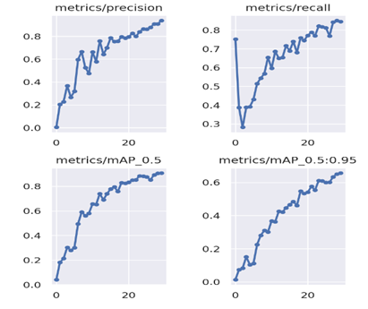
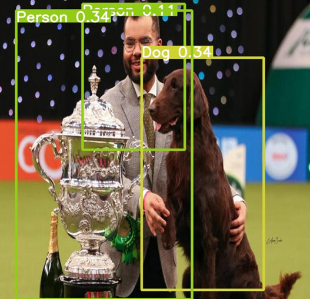
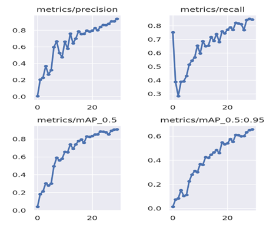
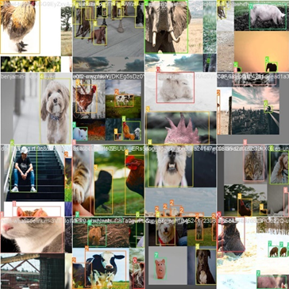
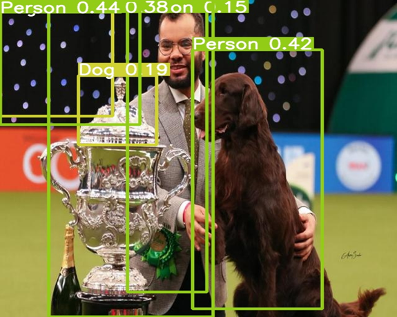
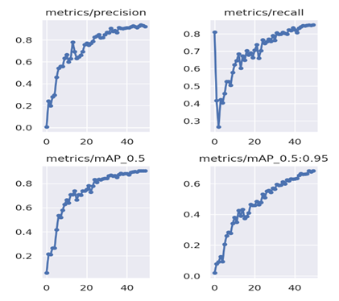
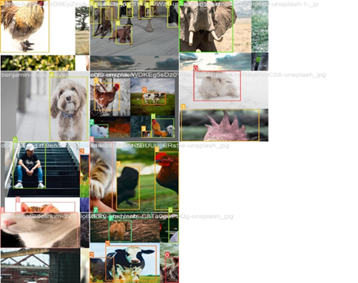

---
---
---

# **TECHNIQUES IN MACHINE LEARNING & ARTIFICIAL INTELLIGENCE (C7082) ASSESSMENT**

## JABEN PETER DARINYAN BAKO (213221)

## 2023-01-17

## Github Link: [<https://github.com/Jabendah/C7082-Assessment>]

### **1. BACKGROUND**

As Artificial Intelligence and Deep Learning models continue to advance, the field of Zoology also has great potential for innovation. The goal of this work is to be able to develop an image classification model utilizing YOLOv5 that can distinguish between 8 different classes of farm animals.

Based on my interest in the field and on the subject of AI and machine learning, using technology to quickly and accurately detect selected farm animals is the primary aim of this work. As a result, after reading and analyzing the works of many authors, Yolov5 Algorithm is a tool that can quickly and effectively detect objects of interest, saving time and labor.

### **2. MOTIVATIONS**

This work is broadly aimed at using YOLOv5 to detect some selected Farm Animals with key consideration on the speed of the model and accuracy level, more specifically;

1.  Training and testing the model accuracy using the coco128 model framework with 30 epochs and 16 batches.

2.  Training and testing with 50 epochs and a reduced batch of 10,

3.  Training and testing model with 70 epochs and 10 batches

### **3. METHODS**

**Source of Data:**

The data used in this analysis was curated from mainly google. A total of 480 pictures were downloaded and split into the following eight training (8) classes;

1.  Bear = 50

2.  Cattle = 50

3.  Cat = 50

4.  Chicken = 50

5.  Dog = 50

6.  Elephant = 50

7.  Person = 50

8.  Pig = 50

The remaining 80 images were 10 pictures each representing the 8 classes.

**Data Analysis:**

YOLO an acronym for 'You only look once', is an object detection algorithm that divides images into a grid system. Each cell in the grid is responsible for detecting objects within itself. [Ultralytics' YOLOv5](https://ultralytics.com/yolov5) ("You Only Look Once") model family enables real-time object detection with convolutional neural networks.

Link to cloning the curated dataset from roboflow:

```{python}
!pip install roboflow

from roboflow import Roboflow 

rf = Roboflow(api_key="Brd3ELP5PCWCmywMoJzI")

project = rf.workspace("213221").project("21322100") 

dataset = project.version(1).download("yolov5")
```

#### Step 1. Installation of requirements:

The dependencies for running the YOLOv5 are.

```{python}
# clone YOLOv5 from github # change pwd to 'yolov5'

!git clone https://github.com/ultralytics/yolov5 

 import os os.chdir('yolov5')

%pip install opencv-python-headless

%pip install -qr requirements.txt

%pip install -q roboflow

import torch from IPython.display 

import Image, clear_output
```

#### Step 2: Training

Train the YOLOv5s6, though bigger models can be used for improved results. Different training approaches might be considered for different situations, and here we will cover the most used techniques. Here, we can pass a few arguments:

-   batch --- batch size (-1 for auto batch size). Use the largest batch size that your hardware allows for.

-   epochs --- number of epochs.

-   data --- path to the data-configurations file.

-   cfg --- path to the model-configurations file.

-   weights --- path to initial weights.

-   cache --- cache images for faster training.

-   img --- image size in pixels (default --- 640)

#### Clone George's repo

```{python}
!git clone https://github.com/georginaanna/Implementing-YOLOv5
```

The above line of code was used to clone the yolov5 coco128 dataset from George's GitHub repo which was used as a framework to build on. To train the model, the following code was executed;

```{python}
# training the coco128 dataset
!python train.py –img 416 –batch 16 –epochs 30 –data /content/yolov5/Implementing-YOLOv5/yolo-files/coco128.yaml –weights yolov5s.pt –cache
```

#### 3: Testing

After training, the model is tested with selected pictures saved in the test folder to see its accuracy and the speed of execution. The code below is used for execution of the test.

```{python}
# make the "exp" from the trained model to test  while specifying the file path for the test
!python detect.py –weights runs/train/exp/weights/best.pt –img 416 –conf 0.1 –source /content/yolov5/Implementing-YOLOv5/coco128/test
```

### TRAINING AND TESTING OF MY DATA

***Training***

400 (50 per class) images were curated for the training object detection system. In the models, we used the LR (Learning Rate) as 0.01, the photo size as 640 px (pixel), the batch size as 16, and the number of epochs as 30, 50, and 70 for the three (3) objectives respectively.

Training of the models were on Google Colab using Tesla with the following code.

```{python}
# Training path
!python train.py –img 416 –batch 16 –epochs 30 –data /content/yolov5/21322100-1/data.yaml –weights yolov5s.pt –cache
```

***Testing***

For the testing of the trained model, 10 images were selected to represent each of the 8 classes to give us a total of 80 images. Testing of all the trained models was also done on Google Colab using Tesla.

```{python}
!python detect.py –weights runs/train/exp2/weights/best.pt –img 416 –conf 0.1 –source /content/yolov5/21322100-1/test/images
```

### **4. RESULTS**

In models trained, the emphasis is on;

i.  Precision,
ii. Recall,
iii. [mAP\@IoU](mailto:mAP@IoU){.email}:0.5

### **Objective 1:** *Training and testing the model accuracy using the coco128 model framework with 30 epochs and 16 batch.*



{width="414"}

From the above figures, it was detected from the model that the Precision and Recall detects the model with 0.90 or 90% Precision at 0.5 mean Average Precision, Precision 0.939 while Recall is 0.842.The test accuracy of the model was accurate although there was no misclassification. An image showing the result of the test is below.

{width="411"}

### **Objective 2:** *Training and testing with 50 epochs and a reduced batch of 10*

{width="411"}

{width="410"}

The result of the Precision and Recall tells us that we can detect our model with 0.90 Precision at 0.5 mean Average Precision, Precision 0.94, and Recall 0.85. The test accuracy of the model was reduced and there were a few misclassifications. An image showing the result of the test is below.

{width="423"}

### **Objective 3:** *Training and testing model with 70 epochs and 10 batch*

{width="427"}

{width="431"}

As detected, the Precision, Recall interprets the model with 0.91 Precision at 0.5 mean Average Precision, Precision of 0.94 and Recall 0.88. As seen above, some images were loss in the training. The test accuracy of the model was reduced although there were a few more misclassifications. An image showing the result of the test is below.

.jpg){width="433"}

## **5. DISCUSSION**

In this study, a detection system was created that can identify some farm animal images using the YOLOv5 single-stage object architecture. The data was curated with the help of google, annotated, trained, and tested using the system on Google Colab. The system achieved a maximum mAP value detection of 91%. Additionally, the system successfully recognized various farm animals. The accuracy of the model could be improved by increasing the dataset size through the addition of new images and data augmentation techniques.

## **6. LITERATURE**

i.  Ultralytics. (2021): Train Custom Data. Retrieved October 4, 2021, from Ultralytics Github website: <https://github.com/ultralytics/yolov5/wiki/Train-Custom-Data>
ii. Redmon, J., Divvala, S., Girshick, R., & Farhadi, A. (2016): You only look once: Unified, real-time object detection. 2016 IEEE Conference on Computer Vision and Pattern Recognition (CVPR). I
